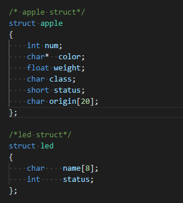
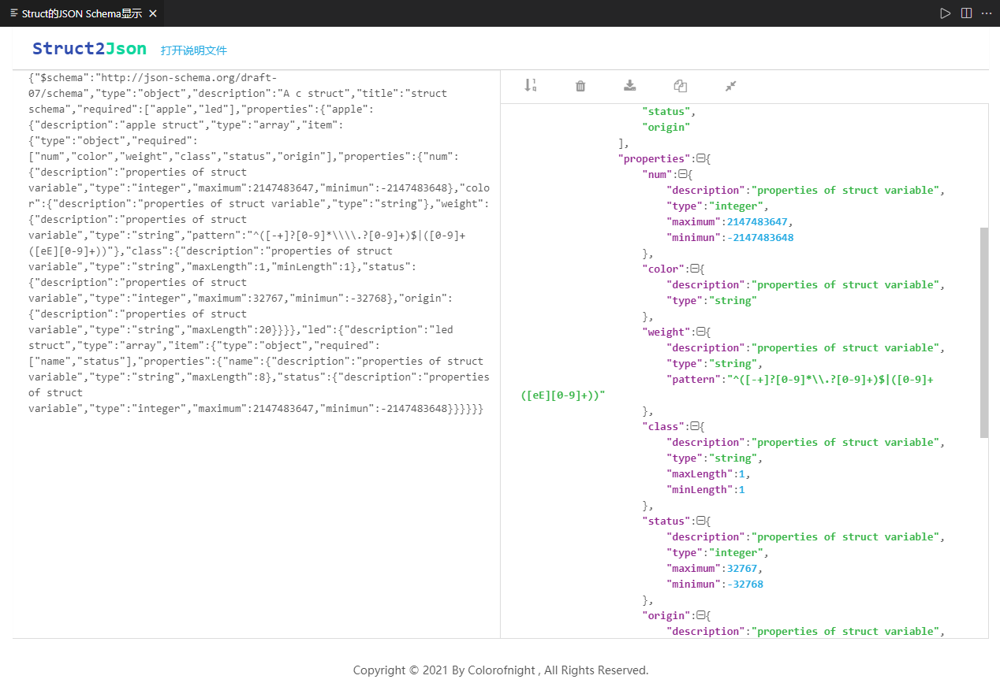

# struct2jsonschema

以JsonSchema格式定义并可视化显示C语言的结构体

## 特性

### 结构体可视化

### 字符统计

## 版本信息

Users appreciate release notes as you update your extension.

### 1.0.0

初始化插件，增加特性 结构体可视化

### 1.0.1

增加特性 字符统计

## 感谢支持

* [开源软件供应链点亮计划](https://summer.iscas.ac.cn/#/org/prodetail/210180823)

